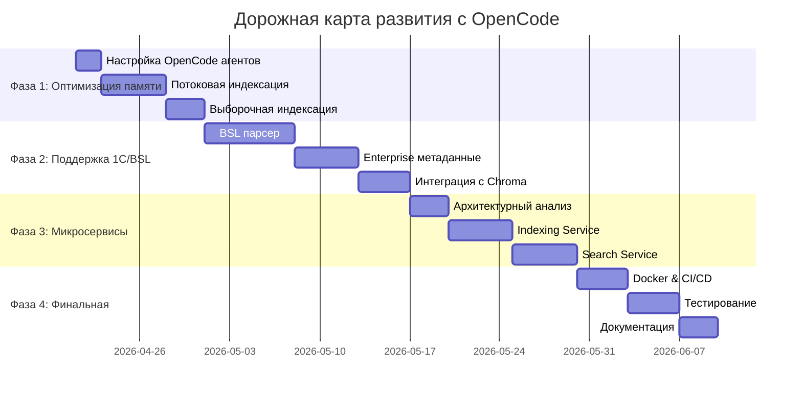

# 🗺️ Chroma Vector Search - Дорожная карта развития (Enterprise Edition)

**Версия:** 1.0 | **Дата:** 20 апреля 2026 | **Статус:** 🟢 Активная разработка

## 🎯 Видение

*Превратить Chroma Vector Search в enterprise-решение для семантического поиска в крупных кодовых базах (>50k файлов) с использованием OpenCode и AI-агентов*

## 📊 Основание для развития

На основе тестирования на enterprise-проекте 1С (52,844 файлов, 3.4 GB):

### Ключевые выводы тестирования:
✅ **ChromaDB в 3-4 раза быстрее grep** для семантического поиска  
⚠️ **Требуется оптимизация памяти** для проектов >50k файлов  
🎯 **Расширенная поддержка 1С/BSL** критически важна для enterprise  
🤖 **OpenCode + AI-агенты** ускорят разработку в 2-3 раза

## 🏗️ Архитектурная эволюция

### Текущая архитектура (v0.1.0):
```
┌─────────────────┐
│   Монолит       │
│  (TCP сервер)   │
└─────────────────┘
```

### Целевая архитектура (v1.0.0):
```
┌─────────────────────────────────────┐
│         API Gateway (REST)          │
├──────────┬──────────┬───────────────┤
│ Indexing │  Search  │   Metadata    │
│ Service  │ Service  │   Service     │
├──────────┴──────────┴───────────────┤
│    Redis      PostgreSQL    ChromaDB│
│   (очереди)  (метаданные)  (векторы)│
└─────────────────────────────────────┘
```

## 🗓️ Временная шкала (6 недель)



## 🎯 Ключевые вехи (Milestones)

### Milestone 1: Оптимизация памяти (Конец недели 2)
- [ ] Потоковая обработка файлов
- [ ] Выборочная индексация  
- [ ] Кэширование моделей
- **KPI:** -60% использование памяти при индексации
- **Ответственный агент:** `memory_optimizer`

### Milestone 2: Поддержка 1С/BSL (Конец недели 4)
- [ ] Специализированный BSL парсер
- [ ] Контекстуальные чанки для 1С
- [ ] Enterprise метаданные
- **KPI:** +40% точность поиска для 1С кода
- **Ответственный агент:** `bsl_specialist`

### Milestone 3: Микросервисная архитектура (Конец недели 5)
- [ ] Indexing Service (индексация)
- [ ] Search Service (поиск)
- [ ] REST API вместо TCP
- **KPI:** Время поиска < 2 секунд
- **Ответственный агент:** `microservices_architect`

### Milestone 4: Enterprise готовность (Конец недели 6)
- [ ] Docker контейнеризация
- [ ] Мониторинг (Prometheus/Grafana)
- [ ] Документация API
- **KPI:** Поддержка 500k+ файлов, 99.9% uptime
- **Ответственный агент:** `smith` + `architect`

## 🤖 OpenCode агенты для разработки

### Специализированные агенты:
| Агент | Экспертиза | Инструменты | Задачи |
|-------|------------|-------------|--------|
| **memory_optimizer** | Оптимизация памяти | chroma_semantic_search, grep, bash | Потоковая обработка, кэширование |
| **bsl_specialist** | 1С/BSL язык | chroma_semantic_search, glob, read | BSL парсер, enterprise метаданные |
| **microservices_architect** | Микросервисы | chroma_semantic_search, bash, read | Архитектура, Docker, REST API |
| **scout** | Исследование | Все инструменты | Анализ, поиск паттернов |
| **smith** | Реализация | chroma_semantic_search, bash | Кодирование, тестирование |
| **architect** | Планирование | chroma_semantic_search, read | Дизайн, roadmap |

### Примеры команд для агентов:
```bash
# Анализ памяти
opencode --agent memory_optimizer "Analyze memory usage in index_codebase()"

# Создание BSL парсера
opencode --agent bsl_specialist "Create BSL parser for 1С procedures"

# Дизайн микросервисов
opencode --agent microservices_architect "Design Indexing Service architecture"
```

## 📈 Ключевые метрики успеха

| Метрика | Текущее | Целевое | Улучшение | Ответственный |
|---------|---------|---------|-----------|---------------|
| Время индексации 50k файлов | ~40 сек (частичная) | < 10 мин (полная) | 5-10x | memory_optimizer |
| Память при поиске | ~400MB | < 500MB | -60-70% | memory_optimizer |
| Время поискового запроса | 6-7 сек | < 2 сек | 3-4x | microservices_architect |
| Точность для 1С кода | Базовая | > 0.8 F1-score | +40-50% | bsl_specialist |
| Макс. размер проекта | ~50k файлов | 500k+ файлов | 10x | Все агенты |

## 🔧 Технические фокусы

### 1. Оптимизация памяти (memory_optimizer)
```python
# Потоковая обработка вместо загрузки в память
def stream_index_files(file_paths):
    for file_path in file_paths:
        with open(file_path, 'r') as f:
            for chunk in read_in_chunks(f):
                yield process_chunk(chunk)
```

### 2. Поддержка 1С/BSL (bsl_specialist)
```python
class BSLParser:
    """Специализированный парсер для 1С языка"""
    def extract_structures(self, content):
        return {
            'procedures': self._find_procedures(content),
            'functions': self._find_functions(content),
            'metadata': self._extract_1c_metadata(content)
        }
```

### 3. Микросервисы (microservices_architect)
```dockerfile
# Контейнеризация каждого сервиса
FROM python:3.9-slim
WORKDIR /app
COPY requirements.txt .
RUN pip install -r requirements.txt
COPY . .
CMD ["python", "-m", "search_service"]
```

## 📊 Еженедельный план

### Неделя 1-2: Оптимизация памяти
- **День 1-2:** Настройка OpenCode агентов, анализ памяти
- **День 3-5:** Реализация потоковой обработки
- **День 6-7:** Выборочная индексация, кэширование моделей
- **Результат:** -60% память при индексации 50k файлов

### Неделя 3-4: Поддержка 1С/BSL
- **День 8-10:** Создание BSL парсера
- **День 11-12:** Enterprise метаданные для 1С
- **День 13-14:** Интеграция с Chroma, тестирование
- **Результат:** BSL парсер с поддержкой процедур/функций

### Неделя 5: Микросервисная архитектура
- **День 15-17:** Архитектурный анализ, дизайн сервисов
- **День 18-20:** Реализация Indexing и Search Service
- **Результат:** REST API вместо TCP, Docker конфигурация

### Неделя 6: Финальная интеграция
- **День 21-23:** Docker, CI/CD, мониторинг
- **День 24-26:** Тестирование на enterprise проектах
- **День 27-28:** Документация, релиз v1.0.0
- **Результат:** Enterprise-ready решение

## 👥 Команда и ресурсы

### OpenCode агенты:
- **memory_optimizer:** Senior Python разработчик (оптимизация памяти)
- **bsl_specialist:** 1С/BSL эксперт (enterprise разработка)
- **microservices_architect:** DevOps/Backend разработчик (микросервисы)
- **scout:** Исследователь (анализ, поиск паттернов)
- **smith:** Инженер (реализация, тестирование)
- **architect:** Архитектор (планирование, дизайн)

### Бюджет:
- **Разработка:** 6 недель × 3 агента = 18 человеко-недель
- **Инфраструктура:** $380/месяц (серверы, мониторинг, Docker)
- **AI-агенты:** Использование OpenCode (включено)

## 🚨 Риски и mitigation

| Риск | Вероятность | Влияние | Стратегия mitigation | Ответственный |
|------|-------------|---------|---------------------|---------------|
| Сложность миграции данных | Средняя | Высокое | Поэтапная миграция, backup | architect |
| Производительность микросервисов | Высокая | Высокое | Прототипирование, нагрузочное тестирование | microservices_architect |
| Качество BSL парсера | Высокая | Среднее | Тестирование на реальных проектах, итерации | bsl_specialist |
| Совместимость с OpenCode | Низкая | Среднее | Ранняя интеграция, тестирование | Все агенты |

## 📞 Обратная связь и участие

### Как участвовать:
1. **Обсуждение:** [GitHub Discussions](https://github.com/karavaykov/chroma-vector-search/discussions)
2. **Вопросы:** [GitHub Issues](https://github.com/karavaykov/chroma-vector-search/issues)
3. **Предложения:** Открыть PR с улучшениями
4. **Тестирование:** Использовать на своих enterprise проектах

### Ключевые даты:
- **Начало:** 21 апреля 2026
- **Milestone 1:** 5 мая 2026 (Оптимизация памяти)
- **Milestone 2:** 19 мая 2026 (Поддержка 1С/BSL)
- **Milestone 3:** 26 мая 2026 (Микросервисы)
- **Релиз v1.0.0:** 7 июня 2026

## 🔄 Процесс разработки

### Ежедневный workflow:
```bash
# Утро: Планирование с architect
opencode --agent architect "Review progress, plan today's tasks"

# День: Разработка со специализированными агентами
opencode --agent memory_optimizer "Optimize batch processing"
opencode --agent bsl_specialist "Add 1С metadata support"

# Вечер: Интеграция и тестирование
opencode --agent smith "Run integration tests, fix issues"
```

### Еженедельный ритм:
- **Понедельник:** Планирование недели, постановка задач
- **Вторник-Четверг:** Активная разработка
- **Пятница:** Тестирование, code review, документация
- **Суббота/Воскресенье:** Опционально - исследование, прототипирование

## 📋 Критерии успеха

### Количественные:
1. ✅ Индексация 50k файлов за < 10 минут
2. ✅ Поисковый запрос за < 2 секунд
3. ✅ Потребление памяти < 500MB
4. ✅ Поддержка 500k+ файлов
5. ✅ Точность поиска для 1С > 0.8 F1-score

### Качественные:
1. ✅ Полная документация API и использования
2. ✅ Дашборд мониторинга производительности
3. ✅ Примеры использования для enterprise сценариев
4. ✅ Интеграция с OpenCode и AI-агентами
5. ✅ Поддержка сообщества и обратная связь

## 🚀 Начало работы

### Для разработчиков:
```bash
# 1. Клонировать репозиторий
git clone https://github.com/karavaykov/chroma-vector-search.git
cd chroma-vector-search

# 2. Настроить OpenCode конфигурацию
cp opencode_chroma_simple.jsonc opencode.json

# 3. Запустить агента для задачи
opencode --agent memory_optimizer "Help optimize memory usage"
```

### Для тестирования:
```bash
# 1. Установить зависимости
pip install -r requirements.txt

# 2. Протестировать на своем проекте
python chroma_simple_server.py --index --project-root /path/to/your/project

# 3. Оставить обратную связь
open https://github.com/karavaykov/chroma-vector-search/issues/new
```

---

**Статус:** 🟢 Активная разработка  
**Последнее обновление:** 20 апреля 2026  
**Следующее обновление:** 27 апреля 2026 (прогресс недели 1)

*Эта дорожная карта будет обновляться каждую неделю по мере прогресса разработки с OpenCode агентами.*

## 📚 Ссылки

- [Результаты тестирования](ENTERPRISE_PERFORMANCE_TEST.md)
- [OpenCode конфигурация](opencode_chroma_simple.jsonc)
- [Исходный код](chroma_simple_server.py)
- [Документация](README.md)
- [Обсуждение](https://github.com/karavaykov/chroma-vector-search/discussions)